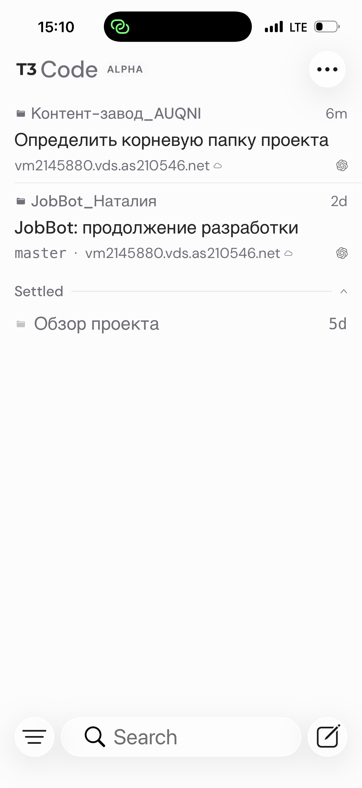
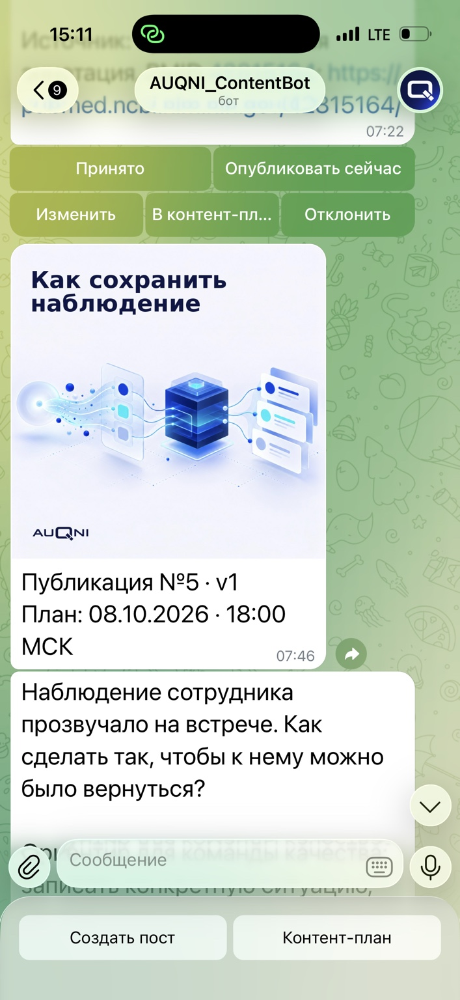
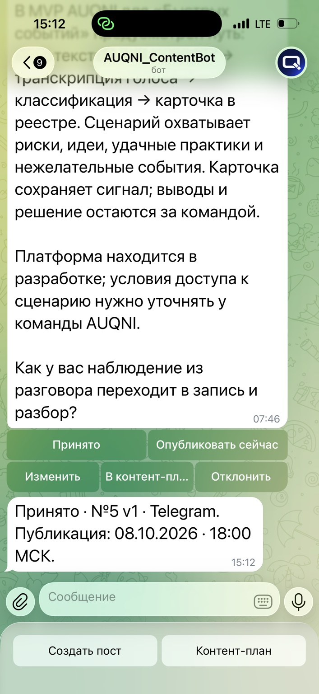
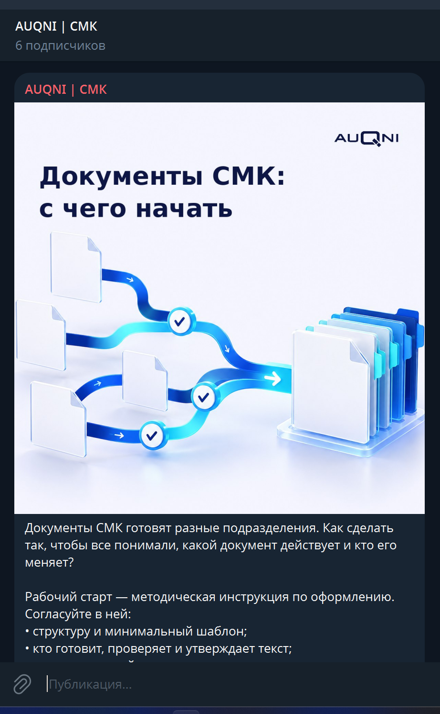
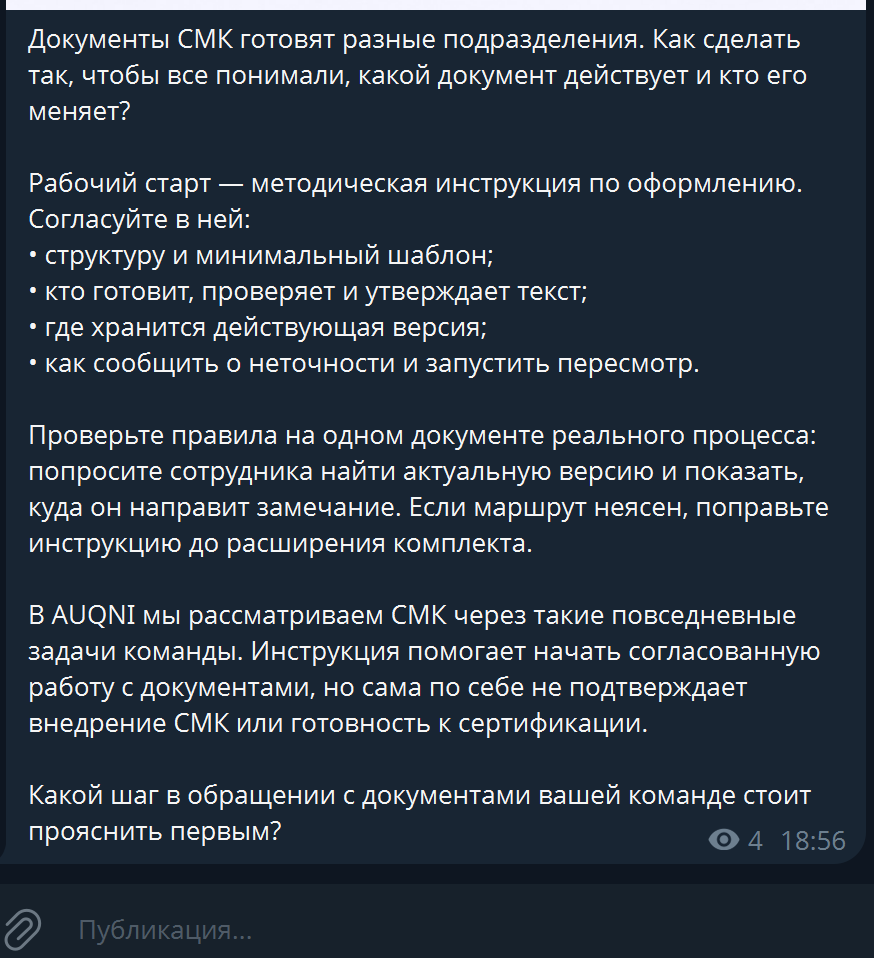
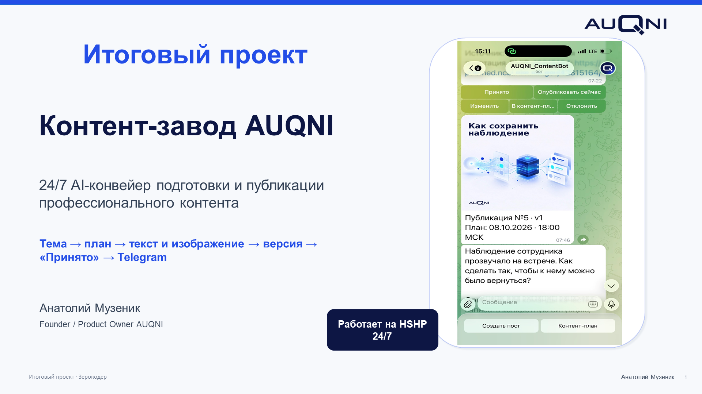

# Контент-завод AUQNI

Итоговый проект «Зерокодер»: серверный прототип редакционного конвейера для подготовки контента AUQNI о системе менеджмента качества в медицинских организациях. Владелец управляет им через личный Telegram-чат; Python-служба работает 24/7 на удалённом сервере HSHP, хранит план, запускает подготовку текста и изображения, показывает результат на согласование и отправляет принятый материал в Telegram по расписанию.

**Это публикационная версия исходного кода и устройства проекта.** Рабочая база, переписка, вложения, журнал отправок, исходные документы и секреты в репозиторий не входят. Учебный [пример контракта](examples/demo-content.json) не предназначен для публикации.

## Что умеет текущая версия

- Принимает тему, текст, голосовое сообщение, фото, видео или документ в личном чате владельца. Голос расшифровывается через OpenAI Audio Transcriptions при наличии ключа.
- Ведёт банк идей и календарь Telegram с постоянными номерами материалов `№N` и отдельными версиями `v1`, `v2` и далее.
- Вызывает Codex CLI с Orchestrator, Writer и Image Agent. Результат Writer — единый JSON `auqni-content/v1` с текстами для сайта, Telegram, VK и Instagram; фактическая автоматическая отправка подключена только для Telegram.
- Проверяет текст и PNG штатным dry-run перед показом владельцу. Изменение версии или даты снимает прежнее «Принято».
- Отправляет по расписанию лишь принятую текущую версию. При неопределённом результате сети не повторяет отправку автоматически.
- Хранит историю заданий, версии, состояние каналов и результаты публикаций в SQLite; отправки дополнительно фиксирует JSONL-журнал.

## Сценарий владельца

1. В личном чате нажать «Создать пост» или открыть «Контент-план» и добавить идею.
2. Получить подготовленный текст и изображение, проверить факты и визуал.
3. При необходимости написать `Поправь №N: ...` или `Перенеси №N на ДД.ММ.ГГГГ ЧЧ:ММ`.
4. После проверки нажать «Принято» для запланированной отправки либо явно выбрать «Опубликовать сейчас».
5. При статусе `uncertain` сверить Telegram-канал и журнал вручную до любых дальнейших действий.

Время слотов задаётся в [pult_config.json](pult_config.json) по `Europe/Moscow`. В базе оно хранится в UTC.

Дополнительный поток [SMK_SATIRE](docs/smk-satire.md) подготовлен для короткого профессионального юмора по будням в 08:30 МСК. Его первый банк содержит 60 кандидатов, из которых отобраны 40. Поток пока выключен до редакционного просмотра владельцем; включённый поток требует отдельного «Принято» для каждого текста. Основное расписание четырёх содержательных публикаций сохранено.

## Автономное планирование и источники

Раз в день после настроенного часа планировщик ищет свободные слоты на горизонте 10 дней. Он обновляет мониторинг, учитывает прежние темы и предлагает до четырёх новых тем из редакционных направлений. Темы становятся заданиями на подготовку; готовые материалы остаются черновиками до «Принято». Идеи с датой автоматически переходят в подготовку за 72 часа до слота.

Мониторинг читает открытые материалы НКИ, WHO Newsroom и PubMed через [monitoring/check.py](monitoring/check.py). Конфигурация источников находится в [monitoring/config.json](monitoring/config.json); правила отбора — в [редакционной политике](docs/editorial-policy-v1.md). Для продуктовых утверждений Writer использует отдельные подтверждённые материалы AUQNI. Их рабочие оригиналы, как и внутренний реестр внешней среды, не включены в публичный набор. Без них автоматическая генерация содержательного контента не считается настроенной.

## Архитектура и структура

```text
Telegram владельца ↔ telegram_pult.py ↔ SQLite (план, идеи, версии, статусы)
                              │
                              ├─ pult_planner.py → мониторинг → Codex CLI
                              ├─ pult_core.py → Orchestrator → Writer → Image Agent
                              └─ telegram_channel.py → telegram_publish.py → Telegram
```

Пути доступа к проекту:

```text
iPhone  → T3 Code            → HSHP → Контент-завод AUQNI
ноутбук → VS Code Remote SSH → HSHP → Контент-завод AUQNI
```

Оба пути ведут к одной и той же физической серверной версии проекта на HSHP, а не к двум копиям.

```text
.agents/skills/       копии двух проектных Skills
.codex/agents/       копии определений Writer, Image, Video и Publisher
docs/                публичные редакционные и визуальные правила
examples/            искусственный учебный JSON
monitoring/          код и конфигурация внешнего мониторинга
screenshots/         место для обезличенных снимков итоговой работы
visual-references/brand/  брендовые PNG для визуального агента
vk_publish.py, test_vk_publish.py  отдельный VK publisher и тесты
*.py, pult_config.json  Пульт, планировщик, publisher и тесты
```

Skills и агенты внутри репозитория являются каноническими версионируемыми определениями Контент-завода. Рабочие копии уровнем выше проекта нужно сверять с ними при развёртывании. Текущий код рассчитывает `workspace` как каталог на два уровня выше файла `telegram_pult.py`; там же ищет `.agents/skills`, `.codex/agents` и `docs/AUQNI_KNOWLEDGE_SOURCE.md` с `docs/AUQNI_COMMUNICATIONS_SOURCE.md`. При развёртывании нужно разместить проверенные проектные инструкции и внутренние документы в этом workspace. Разрешённые бренд-ассеты теперь есть в `visual-references/brand`; сторонние moodboard/Pinterest-референсы в репозиторий не включены.

## Демонстрация

1. Доступ к серверному проекту через T3 Code.

   

2. Подготовленная публикация в Telegram-Пульте.

   

3. Статус «Принято» перед публикацией.

   

4. Опубликованный пост в Telegram-канале — визуальная часть.

   

5. Опубликованный пост — текст и подтверждение фактической публикации.

   

## Запуск на HSHP

Для серверного сценария нужны Python 3.12, авторизованный Codex CLI, доступ к используемым им моделям и генерации изображений, а также Telegram-бот с правом публикации в целевом канале. Путь службы и учётные данные задаются при развёртывании; серверный unit с персональным путём в публичный набор не включён.

1. Разместите проект в workspace с указанными выше Skills, агентами и проверенными внутренними источниками. Настройте `pipeline_command` и расписание в `pult_config.json`.
2. Храните `TELEGRAM_BOT_TOKEN`, `AUQNI_OWNER_USER_ID` и при необходимости `OPENAI_API_KEY` вне репозитория в защищённом файле окружения службы с правами `0600`. Не помещайте `.env` в каталог проекта.
3. Проверьте код без сети: `python3 -B -m unittest test_pult_store.py test_telegram_pult.py test_pult_planner.py test_telegram_publish.py`.
4. Проверьте окружение без Telegram-запросов: `python3 -B telegram_pult.py --check`. Эта проверка показывает наличие компонентов, но не доказывает работу headless-генерации.
5. Настройте отдельную пользовательскую службу на HSHP с рабочим каталогом проекта и защищённым файлом окружения. Запуск `python3 -B telegram_pult.py` начинает long polling личного бота; запускайте только один экземпляр. Реальную отправку проверяйте на отдельно согласованном материале.

Рабочие `pult_data/`, `posts/`, `images/`, `source/`, сторонние визуальные референсы и журнал публикаций сохранены на сервере, но исключены из публичного Git. SQLite и JSONL нужно резервировать **согласованно**: вместе с ними хранить `pult_data/materials/`, поскольку база содержит абсолютные пути к снимкам версий. GitHub синхронизирует код, бренд-ассеты и проверенные учебные файлы; HSHP остаётся единственным владельцем состояния Пульта и постоянных номеров.

## Ограничения публичного набора

Этот репозиторий показывает реализацию и тесты, но не содержит работающую базу AUQNI, продукционные материалы, ключи и доказательства прав на изображения. Встроенный Publisher Пульта подключён только к Telegram. Роли Video и Publisher описывают более широкий конвейер, однако его дополнительные каналы и платная генерация видео не являются частью автоматически работающего серверного Пульта. Перед реальным использованием нужны актуальные проверенные источники, тестирование headless-генерации на своей серверной среде и отдельное согласование каждой публикации.

## Презентация итогового проекта



Презентация итогового проекта курса «Зерокодер»: задача, архитектура, демонстрация работы и результаты.

- [Скачать PPTX](presentation/AUQNI_final_project_Zerocoder.pptx)
- [Открыть PDF](presentation/AUQNI_final_project_Zerocoder.pdf)
